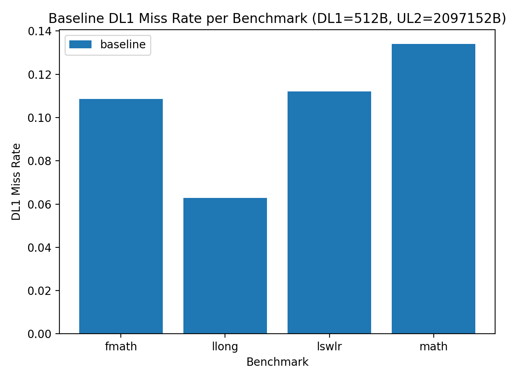
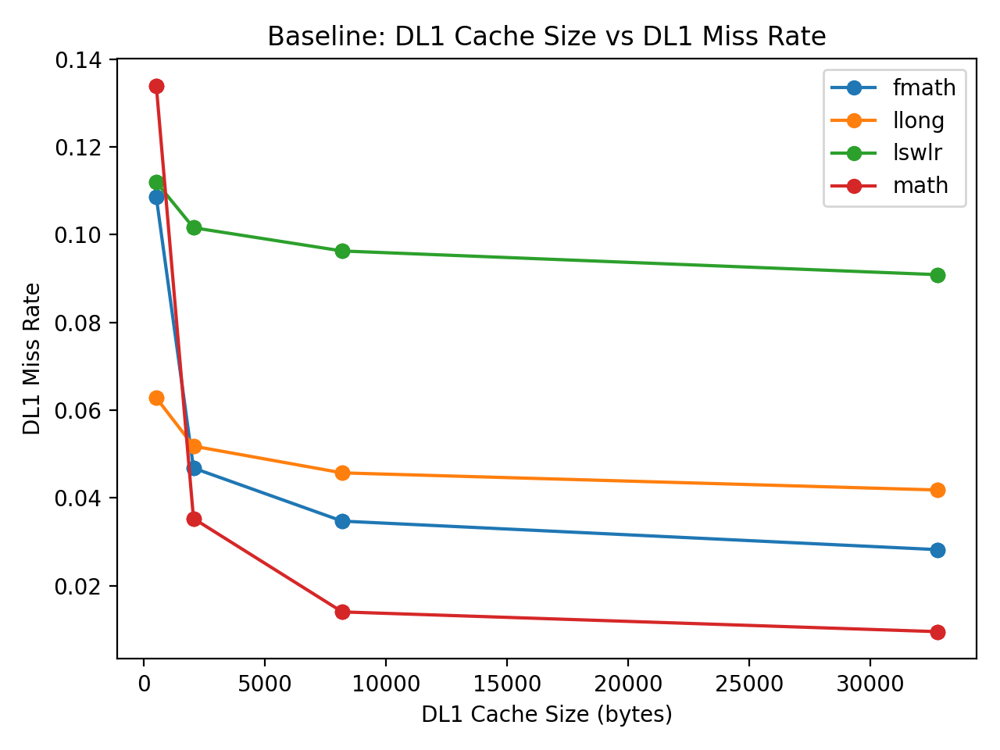
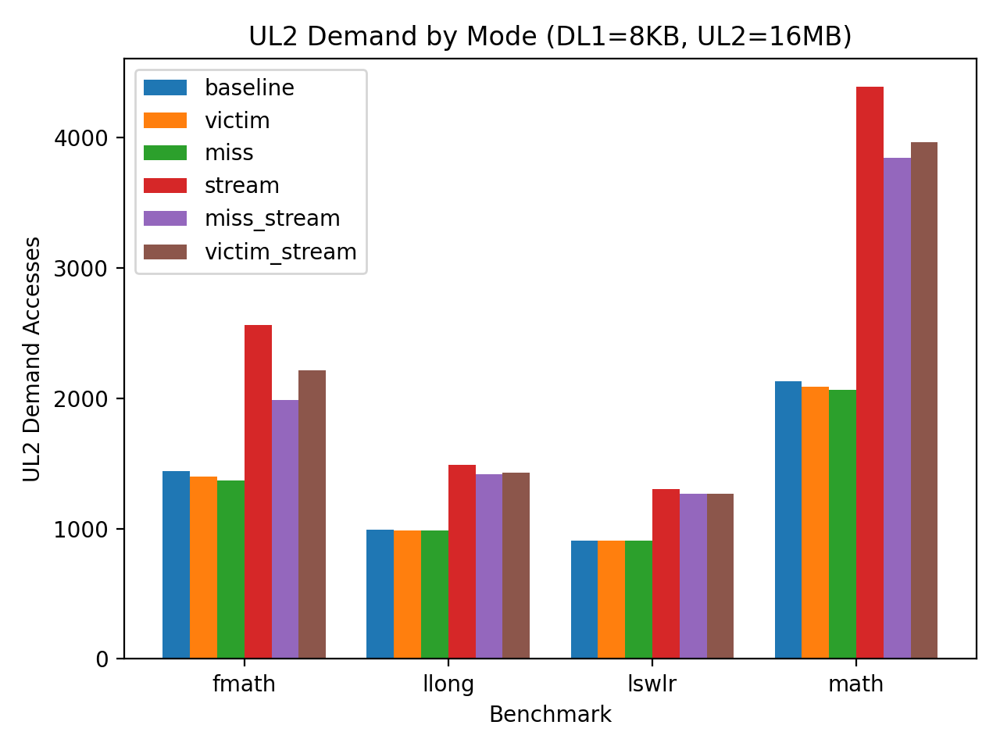
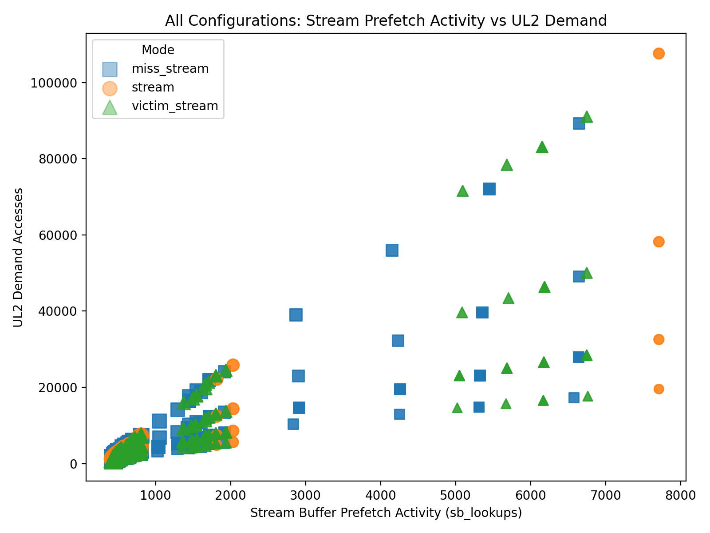
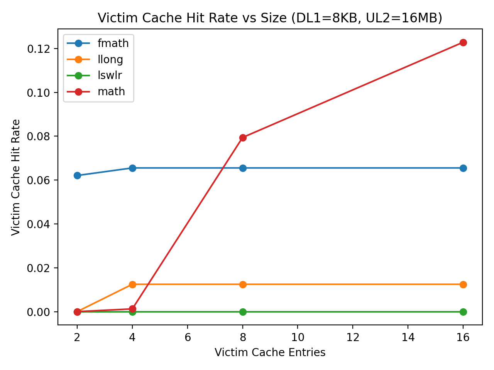
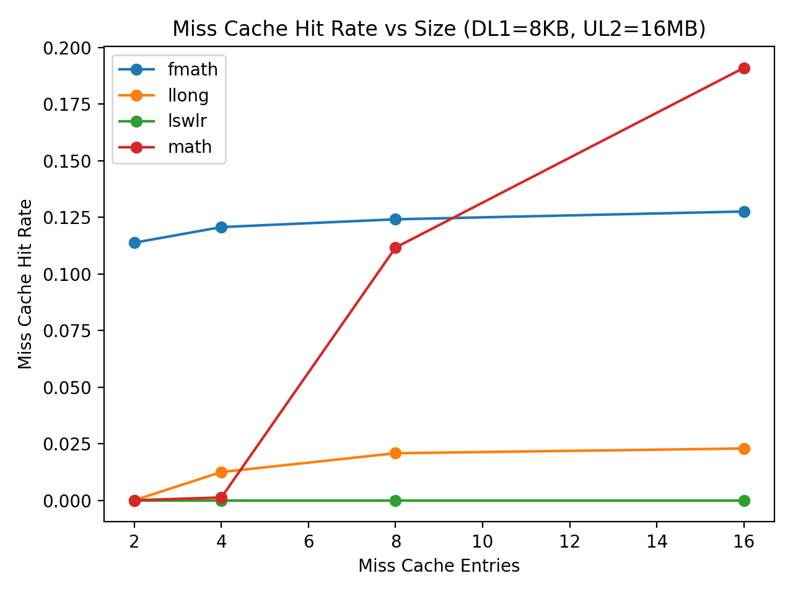
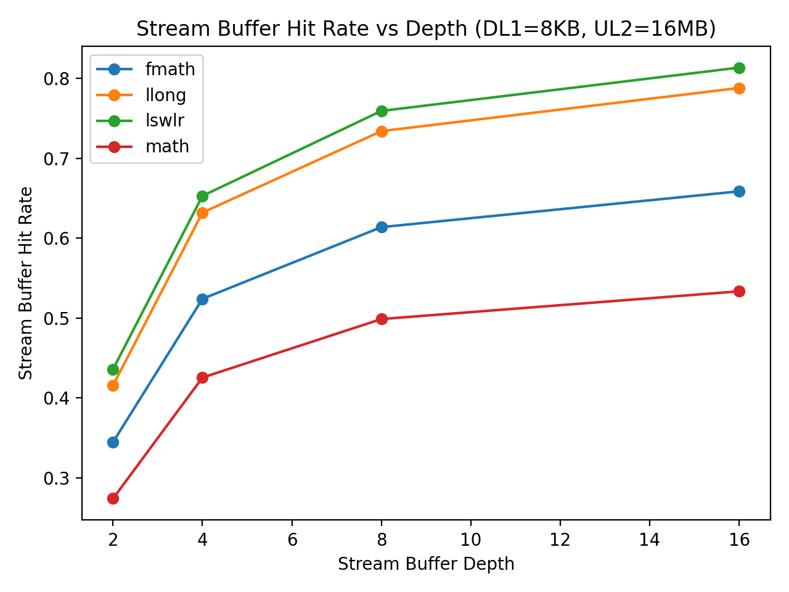

# Results and Analysis

This section presents and analyzes the experimental results obtained from the modified SimpleScalar cache simulator.

Each subsection corresponds to a specific graph used in the analysis. Figures are referenced inline and discussed in terms of architectural behavior, expected trade-offs, and observed trends.

All results are taken from steady-state simulation runs using identical instruction counts and benchmark inputs. Unless otherwise noted, results compare cache mechanisms under fixed cache geometry, allowing the impact of each mechanism to be isolated.

## DL1 Miss Rates by Application

The figure above shows the baseline DL1 Miss Rate per Benchmark with a 512B L1 cache and a 2097152B L2 cache.

## DL1 Miss Rate vs DL1 Cache Size (Baseline)

As expected, increasing the DL1 cache size consistently reduces the DL1 miss rate across all benchmarks. As the cache size increases, a larger fraction of the working set can reside in the L1 cache, resulting in less misses.

The rate of improvement is steepest when increasing DL1 size from the smallest configuration to moderate sizes. Beyond this point, miss-rate reductions begin to taper off, indicating diminishing returns as the working set becomes largely resident in the cache. This behavior is particularly visible in benchmarks such as `fmath` and `math`, which show sharp initial drops followed by gradual decreases.

Differences across benchmarks highlight workload-dependent locality characteristics. For example, `lswlr` maintains a relatively higher miss rate even at larger cache sizes, suggesting a larger or less cache-friendly working set compared to `math`, which benefits significantly from increased DL1 capacity.

## UL2 Demand Trade-Off

The figure above shows the total number of UL2 demand accesses for each cache mechanism with a fixed DL1 size of 8 KB and UL2 size of 16 MB. The victim and miss cache mechanisms result in slightly lower UL2 demand as these buffers resolve potential misses without hitting the UL2 cache. 

In contrast, configurations that include a stream buffer show an increase in UL2 demand. This behavior is expected, as stream buffers proactively issue prefetch requests to UL2 upon detecting sequential access patterns, thereby increasing the number of memory transaction even when not all prefetched lines are consumed. The graph below shows UL2 demand as a function of stream buffer prefetch activity for all configurations with the stream buffer enabled. From the graph, it is seen that more aggressive prefetching results in higher UL2 demand.

Again, we can see in the combined cases that miss caching and victim caching do decrease UL2 demand relative to just using a stream buffer.

## Victim Cache Hit Rate vs Victim Cache Size

This figure shows the victim cache hit rate as a function of victim cache size for four benchmarks with a fixed DL1 size of 8 KB and UL2 size of 16 MB. The results highlight the workload-dependent nature of victim cache effectiveness. The math benchmark exhibits a strong increase in hit rate as the victim cache grows, indicating a high proportion of conflict misses that are successfully captured and reused by the victim cache. In contrast, fmath shows modest gains that saturate quickly, suggesting a smaller set of conflict-reused lines. The llong benchmark benefits minimally, and lswlr sees no measurable improvement, consistent with access patterns dominated by capacity or streaming behavior rather than conflicts. Overall, these results align with the expected role of a victim cache of mitigating conflict misses when short-term reuse exists, but providing little benefit when such reuse is absent.

## Miss Cache Hit Rate vs Miss Cache Size

This figure presents the miss cache hit rate as a function of miss cache size for the same DL1 and UL2 configuration used in the victim cache experiments. Similar to the victim cache results, the effectiveness of the miss cache is strongly workload-dependent. The math benchmark exhibits a pronounced increase in hit rate as the miss cache grows, indicating frequent re-accesses to recently missed cache lines. The fmath benchmark shows moderate gains that saturate early, while llong benefits only marginally and lswlr sees no measurable improvement. Compared to the victim cache, the miss cache achieves higher absolute hit rates, reflecting its ability to capture repeated miss addresses rather than only conflict evictions. These results are consistent with the intended role of a miss cache in reducing redundant memory accesses when temporal reuse of misses exists.

## Stream Buffer Hit Rate vs Depth

This figure shows the stream buffer hit rate as a function of stream buffer depth for all four benchmarks. Across all workloads, increasing the stream buffer depth leads to a monotonic increase in hit rate, with the largest gains occurring between depths of 2 and 8 entries, followed by diminishing returns beyond that point. The lswlr and llong benchmarks achieve the highest hit rates, exceeding 75% at larger depths, indicating strong sequential access patterns that are well suited to stream prefetching. The fmath benchmark exhibits moderate benefit, while math shows the lowest overall hit rate, reflecting less regular memory access behavior. These results confirm that the stream buffer is effectively capturing spatial locality and that modest buffer depths are sufficient to realize most of the achievable benefit.

